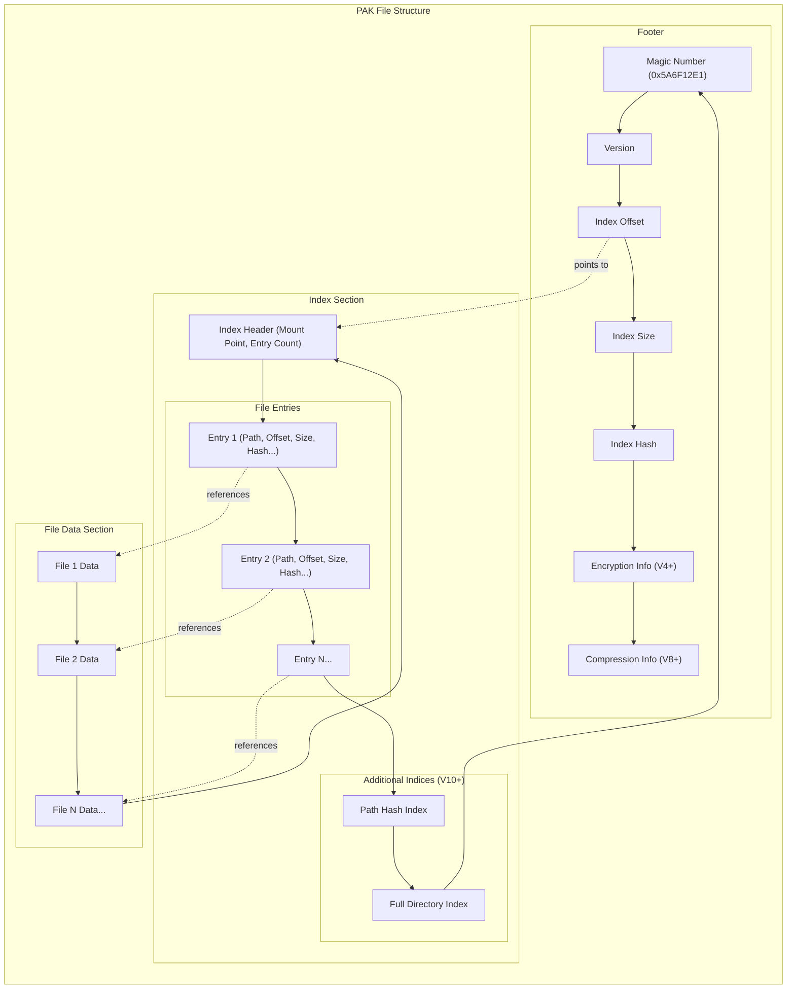

# Unreal Engine .pak File Binary Layout

This document describes the binary layout of Unreal Engine .pak files based on analysis of the repak codebase.

## Overview

Unreal Engine .pak files are archive files used to package game assets. The .pak file format has evolved through multiple versions, with each version adding new features and capabilities. The format consists of several key components:

1. **Magic Number**: A constant value (0x5A6F12E1) that identifies the file as an Unreal Engine .pak file
2. **File Entries**: The actual file data stored in the archive
3. **Index**: A directory of all files in the archive, including their paths and metadata
4. **Footer**: Contains information about the pak file version, offsets to the index, and other metadata

## Binary Layout Diagram



## File Format Versions

The .pak file format has evolved through multiple versions, each corresponding to different Unreal Engine versions:

| Version | UE Version | Major Features Added |
|---------|------------|----------------------|
| V1      | Initial    | Initial specification |
| V2      | 4.0-4.2    | Timestamps removed |
| V3      | 4.3-4.15   | Compression and encryption support |
| V4      | 4.16-4.19  | Index encryption support |
| V5      | 4.20       | Relative chunk offsets |
| V6      | -          | Record deletion support |
| V7      | 4.21       | Encryption key GUID |
| V8A/V8B | 4.22-4.24  | FName-based compression |
| V9      | 4.25       | Frozen index byte |
| V10     | -          | Path hash index |
| V11     | 4.26-5.3   | Fnv64 bug fix |

## Binary Structure

### Footer Structure

The footer is located at the end of the file and contains critical metadata:

```
struct Footer {
    encryption_uuid: Optional<u128>,  // Present in V7+
    encrypted: bool,                  // Present in V4+
    magic: u32,                       // Always 0x5A6F12E1
    version_major: u32,               // Version number
    index_offset: u64,                // Offset to the index
    index_size: u64,                  // Size of the index
    hash: [u8; 20],                   // SHA1 hash of the index
    frozen: bool,                     // Present in V9
    compression: Array<Optional<Compression>>, // Present in V8+
}
```

The footer size varies depending on the version, ranging from 44 bytes in early versions to 196+ bytes in later versions.

### Index Structure

The index contains information about all files stored in the pak:

```
struct Index {
    mount_point: String,              // Base path for all files
    entry_count: u32,                 // Number of file entries
    path_hash_seed: Optional<u64>,    // Present in V10+
    entries: Map<String, Entry>,      // File entries
}
```

In V10+, the index also includes:
- Path Hash Index: For faster file lookups
- Full Directory Index: Organizes files by directory

### Entry Structure

Each file in the pak has an entry with the following structure:

```
struct Entry {
    offset: u64,                      // Offset to file data
    compressed_size: u64,             // Size of compressed data
    uncompressed_size: u64,           // Original file size
    compression_slot: Optional<u32>,  // Compression method used
    timestamp: Optional<u64>,         // Present only in V1
    hash: [u8; 20],                   // SHA1 hash of file data
    blocks: Optional<Array<Block>>,   // Compression blocks
    flags: u8,                        // Bit 0: encrypted, Bit 1: deleted
    compression_block_size: u32,      // Size of compression blocks
}
```

### Block Structure

For compressed files, data is divided into blocks:

```
struct Block {
    start: u64,                       // Start offset of block
    end: u64,                         // End offset of block
}
```

## Reading a .pak File

The process for reading a .pak file is:

1. Seek to the end of the file and read the footer
2. Use the footer to locate and read the index
3. If the index is encrypted, decrypt it using the provided AES key
4. Parse the index to get file entries
5. For each file entry, seek to its offset and read the data
6. If the file is compressed or encrypted, decompress/decrypt as needed

## Writing a .pak File

The process for writing a .pak file is:

1. Write file data to the pak
2. Build the index with entries for each file
3. Write the index
4. Write the footer with offsets to the index

## Compression and Encryption

The .pak format supports multiple compression methods:
- Zlib
- Gzip
- Oodle
- Zstd
- LZ4

For encryption, the format uses AES-256 encryption for both the index and file data.

## Detailed Byte-Level Structure

Below is a more detailed representation of the .pak file structure at the byte level:

```
+---------------------------+
| File Data Section         |
+---------------------------+
| File 1 Data               | <-- Variable length
| File 2 Data               | <-- Variable length
| ...                       |
| File N Data               | <-- Variable length
+---------------------------+
| Index Section             |
+---------------------------+
| Mount Point String        | <-- Variable length (null-terminated)
| Entry Count (u32)         | <-- 4 bytes
| [V10+] Path Hash Seed     | <-- 8 bytes (if V10+)
|                           |
| File Entries:             |
|   Entry 1:                |
|     Path String           | <-- Variable length
|     Offset (u64)          | <-- 8 bytes
|     Compressed Size (u64) | <-- 8 bytes
|     Uncompressed Size(u64)| <-- 8 bytes
|     Compression Slot      | <-- 1 or 4 bytes (version dependent)
|     [V1] Timestamp (u64)  | <-- 8 bytes (if V1)
|     Hash ([u8; 20])       | <-- 20 bytes
|     [V3+] Blocks          | <-- Variable (if compressed)
|     [V3+] Flags (u8)      | <-- 1 byte (if V3+)
|     [V3+] Block Size (u32)| <-- 4 bytes (if V3+)
|   Entry 2...N             |
|                           |
| [V10+] Path Hash Index    | <-- Variable length (if V10+)
| [V10+] Directory Index    | <-- Variable length (if V10+)
+---------------------------+
| Footer                    |
+---------------------------+
| [V7+] Encryption UUID     | <-- 16 bytes (if V7+)
| [V4+] Encrypted Flag      | <-- 1 byte (if V4+)
| Magic Number (u32)        | <-- 4 bytes (0x5A6F12E1)
| Version (u32)             | <-- 4 bytes
| Index Offset (u64)        | <-- 8 bytes
| Index Size (u64)          | <-- 8 bytes
| Index Hash ([u8; 20])     | <-- 20 bytes
| [V9] Frozen Flag          | <-- 1 byte (if V9)
| [V8+] Compression Names   | <-- Variable length (if V8+)
+---------------------------+
```

Note: The actual layout may vary slightly depending on the version of the .pak file. This diagram represents a general structure that covers most versions.
